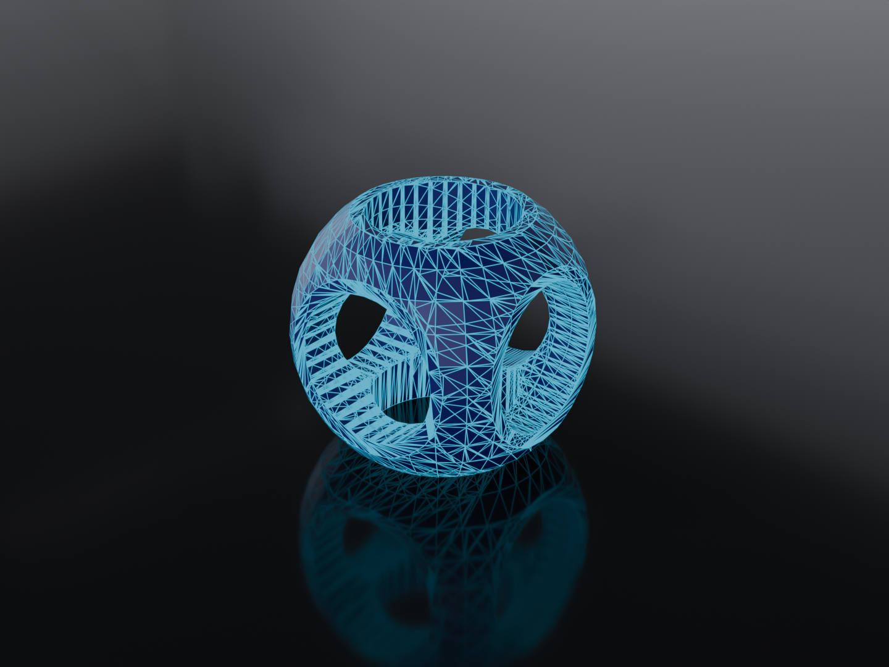

---
css:
  - ./assets/css/variables.css
  - ./assets/css/styles.css
title: Functional Programs for 3D Printing
subtitle:
introductory_notes: |
  Hello Team
light: true
#ratio43: true
embed-css: true
#display-notes: true
overlay: 
author:
  - name: Joe Warren
---

# 2009 : FDM Patent Expires 

:::notes
testing what happens if I put some notes here
:::

--- 

# 2006 : RepRap Project Started 

---

# 2016 : I Buy a 3d Printer 

--- 

{class=bigimage}

<div class="overlay">
[Edmonton Public Library - Giphy](https://giphy.com/gifs/edmonton-yeg-public-library-qYy9yzTYgKFsom1VXf)
</div>

--- 

<embed type="image/svg+xml" class="timeline horizontally-centered" src="./assets/images/process.svg"/>

---

# 2010 : OpenSCAD Released 

---

{class=bigimage}

<div class="overlay">
[By User:Zottie - Own work, CC BY-SA 3.0](https://commons.wikimedia.org/w/index.php?curid=263170)
</div>


---

```javascript
difference() {
    intersection() {
        cube(15, center=true);
        sphere(10);
    }
    union(){
        cylinder(h=50, r=5, center=true);
        rotate([90, 0, 0]) 
            cylinder(h=50, r=5, center=true);
        rotate([0, 90, 0])         
            cylinder(h=50, r=5, center=true);
    }
}

```
---


{class=bigimage}

--- 

# &nbsp;

> People who design stuff are not design engineers,
> they have minimal or no training in
> classic design tools or classic design paradigms,
> and **these objects don't have to be pretty**,
> they just have to work in many cases
> and that's very very different from when
> you design for manufacturing

<br/><br/>

> The key challenge here is that it's
> it's really hard to
> design a language while it's being used
> because backwards compatibility is
> something people really expect when it
> comes to design tools

<br/><br/>

<div style="text-align: right">
[— Marius Kintel, Fosdem 2020](https://www.youtube.com/watch?v=4EZL4O6b0BE)
</div>

:::notes
This is a quote from the Author of OpenSCAD

I think of this first quote as "Rob Pike coded"

(When he said "They’re not capable of understanding a brilliant language", about Go developers)

I'm very sympathetic to the line about backwards compatibility.
But also, breaking changes in APIs are something we as a profession have ways to deal with. 
You don't need every program written with a tool to work with every version.

It's not that there's not a place for OpenSCAD, but there's also room for tools with a different design philosophy.
:::

---

```javascript
 // The value of 'a' reflects only the last set value
    a = 0;
    echo(a);
 
    a = 5;
    echo(a);
```

---


# 2018 : I Write a CSG Library 

---

{class=bigimage}

<div class="overlay">
[LambdAle 2019](https://www.youtube.com/watch?v=pEN9N2B0ygM)
</div>

---

```haskell
object :: Csg.BspTree
object = (cube `Csg.subtract` cross) `Csg.intersection` sphere
    where
        sphere = Csg.unitSphere 32 16
        cube = Csg.uniformScale 1.6 Csg.unitCube
        cylinder = Csg.scale (0.5, 0.5, 3.0) $ Csg.unitCylinder 32
        axes = [(1.0, 0.0, 0.0), (0.0, 1.0, 0.0), (0.0, 0.0, 1.0)]
        cross = foldl1 Csg.union $ map (\a -> Csg.rotate a (pi/2) cylinder) axes
```


---

{class=bigimage}


---

{class=bigimage}

---

{class=bigimage}


<div class="overlay">
[https://bitbucket.org/joe_warren/robot-arm](https://bitbucket.org/joe_warren/robot-arm)
</div>

---

# 1999 : OpenCascade Released 

---

{class=bigimage}

<div class="overlay">
[Maxwxyz, CC BY 4.0](https://commons.wikimedia.org/wiki/File:FreeCAD_1.0_Light_PartDesign_Pozidriv.png)
</div>


---

# 2023 : Waterfall-CAD 

---

```haskell
import qualified Waterfall
import Linear (V3 (..), (^*), unit, _x, _y, _z )
import Data.Function ((&))

object :: Waterfall.Solid
object = let 
    sphere = Waterfall.unitSphere
    cube = Waterfall.uScale 1.5 Waterfall.centeredCube
    cylinder = Waterfall.unitCylinder &
         Waterfall.translate (unit _z ^* (-0.5)) &
         Waterfall.scale (V3 0.55 0.55 4) 
    cylinderA = Waterfall.rotate (unit _x) (pi/2) cylinder
    cylinderB = Waterfall.rotate (unit _y) (pi/2) cylinder
  in (cube `Waterfall.intersection` sphere)
      `Waterfall.difference` (cylinder <> cylinderA <> cylinderB)
```

---

<model-viewer
  src="assets/models/csg.glb"
  environment-image="assets/environments/moon_1k.hdr" 
  shadow-intensity="1" 
  camera-controls 
  touch-action="pan-y"
  auto-rotate
  rotation-per-second="90deg"
  style="width: 100%; height: 100%;"
  class="bigimage"
  ></model-viewer>
  
---

# 2024 : Christmas Ornaments 

---

# Waterfall-CAD-SVG

---