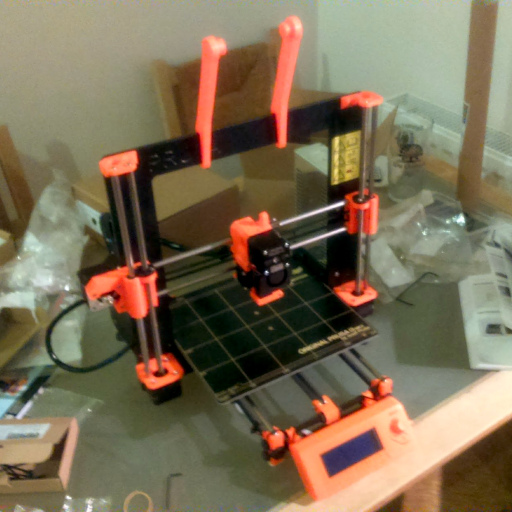

---
css:
  - ./assets/css/variables.css
  - ./assets/css/styles.css
title: Functional Programs for 3D Printing
subtitle:
introductory_notes: |
  Hello Team
light: true
#ratio43: true
embed-css: true
#display-notes: true
overlay: 
author:
  - name: Joe Warren
---

# 2009 : FDM Patent Expires 

:::notes
testing what happens if I put some notes here
:::

--- 

# 2006 : RepRap Project Started 

---

# 2016 : I Buy a 3d Printer 

---

# 2010 : OpenSCAD Released 

--- 

# &nbsp;

> People who design stuff are not design engineers
> they have minimal or no training in
> classic design tools or classic design paradigms
> and **these objects don't have to be pretty** 
> they just have to work in many cases
> and that's very very different from when
> you design for manufacturing

  

> The key challenge here is that it's
> it's really hard to
> design a language while it's being used
> because backwards compatibility is
> something people really expect when it
> comes to design tools

  

[— Marius Kintel, Fosdem 2020](https://www.youtube.com/watch?v=4EZL4O6b0BE)

:::notes
This is a quote from the Author of OpenSCAD

I think of this first quote as "Rob Pike coded"

(When he said "They’re not capable of understanding a brilliant language", about Go developers)

It's not that there's not a place for OpenSCAD, but there's also room for tools with a different design philosophy.
:::

---

# 2018 : I Write a CSG Library 

---

# 1999 : OpenCascade Released 

---

# 2023 : Waterfall-CAD 

---

# 2024 : Christmas Ornaments 

---

# Waterfall-CAD-SVG

---