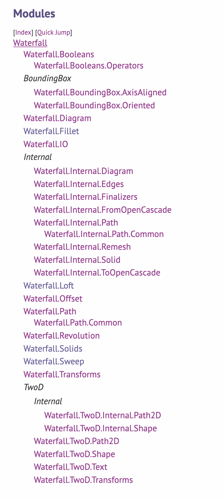

---
css:
  - ./assets/css/variables.css
  - ./assets/css/styles.css
title: How I Use Haskell for 3D Printing
subtitle:
introductory_notes: |
  Hello Team
light: true
ratio43: true
embed-css: true
#display-notes: true
overlay: 
author:
  - name: Joe Warren
---

# 2009 : FDM Patent Expires 

:::notes
In my opinion, the story of 3d printing really starts in 2009.

This is when a patent expires, which was held by a company called Stratasys.

The patent's for a process called:

Fused Deposition Modeling (trademarked term)

Filament Freeform Fabrication (generic term)

Manufacturing technique used by 3d printers 
:::

--- 

# 2006 : RepRap Project Started 

:::notes
Founded By Adrian Bowyer at the University of Bath.

Aiming to make a 3d Printer that can be used to manufacture other 3d Printers.

Anticipated the patent expiration 3 years later.

RepRap is an open hardware project, and this leads to a boom of open source 3d printer designs.
:::

---

# 2016 : I Buy a 3d Printer 

:::notes
Ten years after the RepRap project was founded, I buy a 3d printer. 

This is a Prusa i3 mk2, which is a variation on the RepRap design.
:::

--- 

{class=bigimage}

<div class="overlay">
[Edmonton Public Library - Giphy](https://giphy.com/gifs/edmonton-yeg-public-library-qYy9yzTYgKFsom1VXf)
</div>

:::notes
I think It's easier to show how FDM printing works than to describe it. 

There's a spool of filament, this is melted and fed through a print head. 

The print head can move in three axes. 

It traces a path, forming a layer, which it'll go on to print more layers on top of.

In this way it builds up a 3d object.
:::

--- 

<embed type="image/svg+xml" class="timeline horizontally-centered" src="./assets/images/process.svg"/>

:::notes
When you're preparing a 3d print, you generally work with two different types of data before you get to a solid object.

You have the path that the print head traces out, and this is stored in a format called GCode.

GCode is generally generated from a 3d model using a program called a Slicer. 

A slicer generally reads 3d geometry in a mesh format, like a list of triangles, often in a format called STL.

This format is also used in 3d computer graphics. 

The rest of this talk is going to deal entirely with stuff that's to the left of this diagram. 

I'm pretending "how do I take a 3d file, slice it, and then print it" as a solved problem.

Instead, I'm focusing on how you come up with the mesh at the start of this process.
::: 
---

# 2010 : OpenSCAD Released 

:::notes 
In the year 2010, one year after the Stratasys patent expires, a program called OpenSCAD is released. 

Started by a developer called Marius Kintel.

This is described as "The Programmers Solid 3D CAD Modeller".

It's a DSL for designing 3d printable objects.

:::

---

{class=bigimage}

<div class="overlay">
[By User:Zottie - Own work, CC BY-SA 3.0](https://commons.wikimedia.org/w/index.php?curid=263170)
</div>

:::notes
Modeling in OpenSCAD is largely based around a concept called Constructive Solid Geometry or CSG.


CSG involves taking primitive shapes, like spheres, cylinders and cubes, transforming them into a position, and then combining them with boolean operaters, like `intersection`, `union`, and `difference` (or `subtraction`).

With these relatively simple primitive operations, you can build up quite complicated forms.

This example's pulled from Wikipedia, and often used to demonstrate CSG modeling

It's taking the intersection of a cube and a sphere, to make a rounded cube.

Combining cylinders that have been rotated into different axes, unioning them to form a cross.

Then it's subtracting the cross from the rounded cube to form this final shape.

CSG approaches are also used in some graphics frameworks (such as raytracers).
:::

---

```javascript
difference() {
    intersection() {
        cube(15, center=true);
        sphere(10);
    }
    union(){
        cylinder(h=50, r=5, center=true);
        rotate([90, 0, 0]) 
            cylinder(h=50, r=5, center=true);
        rotate([0, 90, 0])         
            cylinder(h=50, r=5, center=true);
    }
}
```

:::notes 
This is what the code for that CSG example object looks like in OpenSCAD.

You can hopefully see the relationship between this code and the CSG object:

We have spheres, cubes and cylinders, as well as rotations, and intersections, unions and differences.
:::
---

{class=bigimage}

:::notes
And this is what OpenSCAD gives you if you run that code.
:::

--- 

# &nbsp;

> People who design stuff are not design engineers,
> they have minimal or no training in
> classic design tools or classic design paradigms,
> and **these objects don't have to be pretty**,
> they just have to work in many cases
> and that's very very different from when
> you design for manufacturing

<br/><br/>

> The key challenge here is that it's
> it's really hard to
> design a language while it's being used
> because backwards compatibility is
> something people really expect when it
> comes to design tools

<br/><br/>

<div class="attribution">
[— Marius Kintel, Fosdem 2020](https://www.youtube.com/watch?v=4EZL4O6b0BE)
</div>

:::notes
I think it's good to be a little careful about voicing criticisms of other peoples work, especially open source work.

And I would like to acknowledge that OpenSCAD invented the whole category of Programmable CAD framework. 

With that said, I'm going to be talking about why I prefer to do Programmable CAD without OpenSCAD, which implies criticising it a bit.

The best way I think I can explain my feelings about OpenSCAD is to show a quote from the Author.

I think of this first quote as "Rob Pike coded"

(When he said "They’re not capable of understanding a brilliant language", about Go developers)

I'm very sympathetic to the line about backwards compatibility.
But also, breaking changes in APIs are something we as a profession have ways to deal with. 
You don't need every program written with a tool to work with every version.

It's not that there's not a place for OpenSCAD, but there's also room for tools with a different design philosophy.
:::

---

```javascript
 // The value of 'a' reflects only the last set value
    a = 0;
    echo(a);
 
    a = 5;
    echo(a);
```

:::notes
I also want to get in a classic OpenSCAD bit of weirdness.

This code, from an old version the official OpenSCAD user manual prints 5 twice. 

The user manual motivated this by saying OpenSCAD is a functional language.

They've cleaned up this documentation since, but this is still weird.
:::

---


{class=bigimage}


<div class="overlay">
[clojure.core/typing - Matt Adereth](https://www.youtube.com/watch?v=uk3A41U0iO4)
</div>

:::notes
That example was borrowed from a talk by Matt Adereth, given in 2015. 
The talk is about designing a keyboard, called a Dactyl, using OpenSCAD code generated with Clojure.

A relatively popular to deal with OpenSCAD language weirdness is by doing metaprogramming: writing programs in a different language, and having these programs produce OpenSCAD code.
:::

---


{class=bigimage}

::: notes
I use the keyboard from that talk: this is my dactyl. 

Matt correctly identifies a number of issues with OpenSCAD, which are more subtle than just "it lets you declare values multiple times". 
The key one being that objects in OpenSCAD aren't really "first class": you can't write higher order functions over objects. 

I don't think he identifies every issue with OpenSCAD.

A limitation of OpenSCAD is that it has a two pass execution model.

It evaluates the code, and builds up a tree of CSG operations, and only once it's built that tree does it do a second pass to produce geometry.

The result of this, is that you can't get data out of objects at all, you can't have a function that takes an object, and returns it's volume.

This limits the kinds of program you can write: you can't say generate this object, and keep transforming it in a certain way until it's above a specific size.

Notably, you can't meta-program your way out of the issues with the execution model.
:::

---


# 2018 : I Write a CSG Library 

:::notes
At some point in 2017, I learn Haskell, and, for a range of reasons, some good, some not so good, decide that Haskell would be a good programming language in which to do programmable CAD.

In 2018, I decide to write a Constructive Solid Modeling library, in Haskell.
:::

---

{class=bigimage}

<div class="overlay">
[LambdAle 2019](https://www.youtube.com/watch?v=pEN9N2B0ygM)
</div>

:::notes
A couple of years later, I give a talk on this, at a conference called Lambdale in London.

This is still on YouTube.

It mostly works as an "Algorithms" talk, going into how you can use BSP trees to represent Solid objects.
:::

---

```haskell
object :: Csg.BspTree
object = (cube `Csg.subtract` cross) `Csg.intersection` sphere
  where
    sphere = Csg.unitSphere 32 16
    cube = Csg.uniformScale 1.6 Csg.unitCube
    cylinder = Csg.scale (0.5, 0.5, 3.0) $ Csg.unitCylinder 32
    axes = [(1.0, 0.0, 0.0), (0.0, 1.0, 0.0), (0.0, 0.0, 1.0)]
    cross = foldl1 Csg.union $ map (\a -> Csg.rotate a (pi/2) cylinder) axes
```


---

{class=bigimage}

---

{class=bigimage}

---

{class=bigimage}


<div class="overlay">
[https://bitbucket.org/joe_warren/robot-arm](https://bitbucket.org/joe_warren/robot-arm)
</div>

---

# 1999 : OpenCascade Released 

:::notes
Non-Uniform Rational B-Splines Modeling.

Around eight hundred thousand lines of C++

Matra Datavision started development in 1991, were bought out by Dassault Systèmes (3DS) in '98.
OpenCascade itself is open-sourced in 1999.

Company called Open Cascade SAS is founded to generate profit from Open Cascade.
Acquired and passed around a series of French engineering consultancies.
Eventually wind out owned by Capgemini.

All this detail is intended to give you an impression of the kind of library we're talking about.

Enterprisey, but powerful in the sense that it contains a lot of "stuff".

:::

---

{class=bigimage}

<div class="overlay">
[Maxwxyz, CC BY 4.0](https://commons.wikimedia.org/wiki/File:FreeCAD_1.0_Light_PartDesign_Pozidriv.png)
</div>

:::notes
This is a screenshot of an application called FreeCAD. 

FreeCAD is a graphical CAD tool, built using OpenCascade as a CAD kernel. 

Development on FreeCAD started in 2001, not long after OpenCascade was opensourced. 

FreeCAD's used by, amongst other people, the European Space Agency.
:::


---

# 2023 : Waterfall-CAD 

---

```haskell
import qualified Waterfall
import Linear (V3 (..), (^*), unit, _x, _y, _z )
import Data.Function ((&))

object :: Waterfall.Solid
object = let 
    sphere = Waterfall.unitSphere
    cube = Waterfall.uScale 1.5 Waterfall.centeredCube
    cylinder = Waterfall.unitCylinder &
         Waterfall.translate (unit _z ^* (-0.5)) &
         Waterfall.scale (V3 0.55 0.55 4) 
    cylinderA = Waterfall.rotate (unit _x) (pi/2) cylinder
    cylinderB = Waterfall.rotate (unit _y) (pi/2) cylinder
  in (cube `Waterfall.intersection` sphere)
      `Waterfall.difference` (cylinder <> cylinderA <> cylinderB)
```

---

<model-viewer
  src="assets/models/csg.glb"
  environment-image="assets/environments/moon_1k.hdr" 
  shadow-intensity="1" 
  camera-controls 
  touch-action="pan-y"
  auto-rotate
  rotation-per-second="90deg"
  style="width: 100%; height: 100%;"
  class="bigimage"
  ></model-viewer>

---

# More than just CSG

{class="right" width=200px}

* Rounds, Fillets & Chamfers
* Offset Solids
* Lofts
* Solids of Revolution
* Extrusion along Paths
* Text/Fonts
* Queries over Solids
  * Bounding Boxes
  * Volume
  * Center of Mass
  * Moment of Inertia


---

```haskell
import Waterfall.Solids (Solid)
import qualified Waterfall.TwoD.Path2D as Path2D
import Waterfall.Revolution (revolution)
import Linear (V2 (..))

revolutionExample :: Solid
revolutionExample = 
    revolution $ 
        Path2D.pathFrom (V2 0 0)
            [ Path2D.lineTo (V2 1 0)
            , Path2D.lineRelative (V2 0.1 0.16)
            , Path2D.lineTo (V2 1 0.2)
            , Path2D.arcRelative Path2D.Clockwise 0.1 (V2 0 0.2)
            , Path2D.bezierRelative (V2 (-0.6) 0.0) (V2 (-0.8) 2.2) (V2 (-0.8) 2.6)
            , Path2D.lineTo (V2 0.5 3.0)
            , Path2D.lineRelative (V2 0.1 0.16)
            , Path2D.lineRelative (V2 (-0.2) 0.04)
            , Path2D.lineTo (V2 0.1 3.2)
            , Path2D.arcViaRelative (V2 0.5 0.6) (V2 (-0.1) 1.2)
            ]
```

---

<model-viewer
  src="assets/models/revolution.glb"
  environment-image="assets/environments/moon_1k.hdr" 
  shadow-intensity="1" 
  camera-controls 
  touch-action="pan-y"
  auto-rotate
  rotation-per-second="90deg"
  style="width: 100%; height: 100%;"
  class="bigimage"
  ></model-viewer>

---

{class="bigimage"}

---

# 2024 : Christmas Ornaments 

---

{class="bigimage"}


<div class="overlay">
[Mikołaj Wilczek; kiwicode.dev](https://kiwicode.dev/)
</div>

---

{class="bigimage"}

---

{class="bigimage"}

---

{class="bigimage"}

---

<div class="imagegrid"
>{class="ingrid"}
{class="ingrid"}
{class="ingrid"}
{class="ingrid"}
{class="ingrid"}
{class="ingrid"}
{class="ingrid"}
{class="ingrid"}
{class="ingrid"}
{class="ingrid"}
{class="ingrid"}
{class="ingrid"}
{class="ingrid"}
{class="ingrid"}
</div>

---

{class="bigimage"}

---

<embed type="image/svg+xml" class="timeline horizontally-centered" src="./generated/timeline.svg"/>

--- 


# Links

[QR_CODE_HERE](https://doscienceto.it/cad-talk){.qrcode}

* {width=1em} [Hackage Docs](https://hackage.haskell.org/package/waterfall-cad)
* {width=1em} [Github Repo](https://github.com/joe-warren/opencascade-hs)
* {width=1em} [Discord](https://discord.gg/aHfA4XKpyA)
* {width=1em} [These Slides](https://github.com/joe-warren/cad-talk/)
* {width=1em} Blogposts:
  * {width=1em} [Haskell FFI](https://www.doscienceto.it/blog/posts/2024-01-23-ffi.html)
  * {width=1em} [Things I've Printed](https://www.doscienceto.it/blog/posts/2024-06-30-things-ive-3d-printed-in-haskell.html)
  * {width=1em} [Chessset](https://www.doscienceto.it/blog/posts/2024-09-15-chess-set.html)
  * {width=1em} [Waterfall-CAD SVG](https://www.doscienceto.it/blog/posts/2025-04-14-waterfall-cad-svg.html)